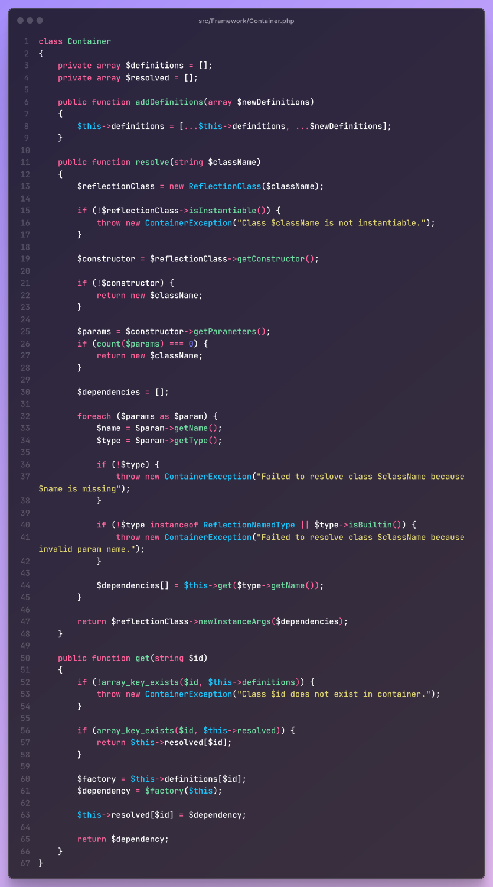

As a team of 4 second-year students, we identified a gap in Sri Lanka's tutoring industry and decided to build something impactful. The result? **LearnHub** - a comprehensive web platform connecting independent tutors with students seeking personalized education.

# **The Problem We Wanted to Solve**

In Sri Lanka, the tuition industry is tough. A few big-name tutors dominate the scene, and it’s really hard for new or independent tutors to get noticed. Most of them rely on posters, word of mouth, or social media just to attract a handful of students.

On the flip side, students often don’t have much choice – they follow the crowd and hope for the best. We wanted to change that.

With LearnHub, our goal was to:

- Give independent tutors a platform to promote themselves and run their classes.
- Help students discover tutors who actually fit their learning style and goals.

# **How We Built It**

Now, here's the thing – for this project, **we weren’t allowed to use any frameworks**.

At first, I was like, “Wait, what? Why not?”

But not being allowed to use a framework turned out to be a blessing in disguise. We had to build everything from scratch and that’s exactly what helped me truly understand how things work under the hood.

Now that I’m working on my third-year project using Spring Boot, I appreciate those fundamentals so much more. Concepts like routing, dependency injection, and services feel natural to me now, because I’ve built my own versions before.

### **Built Our Own MVC Framework**

We actually created our own PHP-based MVC framework from scratch! We handled routing, controllers, and services ourselves. The frontend used reusable layouts, components, and partials keeping things clean and consistent.

### **Implementing Custom Dependency Injection**

One of the first challenges we came across was managing dependencies between our services. We built a custom dependency injection container that automatically resolves and injects dependencies throughout our application.

src/Framework/Container.php

It’s the same concept you see in modern frameworks like Spring, Laravel, or .NET Core but **we built it ourselves.** And that taught us so much about how frameworks really work under the hood.

Because of our custom dependency injection container, services automatically get all their required dependencies. This saved us from having to manually create objects throughout the codebase and kept everything neat and maintainable.

See implementation: [**src/App/container-definitions.php,**](https://github.com/mahima-ucsc/LearnHub/blob/develop/src/App/container-definitions.php) [**src/Framework/Container.php**](https://github.com/mahima-ucsc/LearnHub/blob/develop/src/Framework/Container.php)

### **Routing & Middleware**

handling requests isn’t just about matching URLs. You also need solid security and clean ways to process requests through different layers of logic.

That’s why we built a **custom router** that does much more than route traffic. It:

- **Processes middleware chains** — every request passes through a series of middleware layers that handle security checks, logging, validation, and more.
- **Resolves controller dependencies** automatically via our custom dependency injection container, so controllers stay clean and focused on business logic.
- **Handles the full request lifecycle** — from the moment a request comes in, to sending back the response, our router keeps things seamless.

Alongside this, we developed a powerful **middleware system** to manage all the critical cross-cutting concerns in our app, including:

- **Authentication guards** — making sure only logged-in users can access protected routes.
- **Role-based access control** — ensuring specific sections of LearnHub are accessible only to admins, tutors, or students.
- **Session management** — handling secure login sessions and regenerating sessions on login/logout for security.

Our routing configuration is clean and intuitive, making it super easy to add new features or protect new routes without cluttering the codebase.

Routing System with Middleware Integration

See implementation: [**src/Framework/Router.php**](https://github.com/mahima-ucsc/LearnHub/blob/develop/src/Framework/Router.php), [**src/App/Config/Routes.php**](https://github.com/mahima-ucsc/LearnHub/blob/develop/src/App/Config/Routes.php)

# **Frontend Structure**

Frontend Structure

For LearnHub’s frontend, we went with a **server-side rendering** approach using PHP templates. This means the views are generated on the server, keeping things simple and fast without relying on any fancy frontend frameworks.

We organized the frontend into a neat hierarchy of reusable components, so everything stays consistent and easy to manage across the site.

### **Lightweight Template Engine**

To render views efficiently, we built a lightweight custom **template engine**. It works by extracting variables and rendering PHP templates on the server, making the rendering process fast and flexible without relying on external libraries or frameworks.

See implementation: [**src/Framework/TemplateEngine.php**](https://github.com/mahima-ucsc/LearnHub/blob/develop/src/Framework/TemplateEngine.php)

### **How Our Views Are Structured**

Every page uses a base layout that includes common parts like the header and footer as partials. This approach ensures a unified look and feel throughout LearnHub, while still allowing each page to display its unique content.

Here’s a simple example of the template pattern we use:

View Template Structure

### **Database Abstraction Layer**

Instead of using a heavy ORM, we built a clean database abstraction layer for our MySQL database that provides the essential functionality we need while keeping things simple and performant.

See implementation: [**src/Framework/Database.php**](https://github.com/mahima-ucsc/LearnHub/blob/develop/src/Framework/Database.php)

# **What I Learned**

### **Framework Development is Hard But Rewarding**

Building LearnHub without any existing frameworks was one of the toughest challenges I’ve ever faced. Re-creating things like routing, dependency injection, and template rendering from scratch forced me to dig deep into how web applications really work under the hood.

There were times it felt overwhelming, especially when bugs cropped up in the core architecture we’d written ourselves. But solving those problems gave me a huge sense of confidence. Now, when I use frameworks like Spring Boot, I understand **why** things work the way they do, rather than just following the documentation blindly.

This experience taught me that frameworks are not magic, they’re just code built by people who faced the same problems we did.

### **Collaborative Development**

Working as a team of four taught me how essential good communication and collaboration are for any project. We quickly learned that if we didn’t plan our architecture or divide responsibilities clearly, we’d step on each other’s toes or duplicate work.

We used Git to manage our codebase and made sure to review each other’s commits. That helped us catch bugs early and maintain a consistent coding style.

One of the best parts of working as a team was learning from each other. We all brought different strengths some were stronger in backend, others in frontend, and that diversity made our final product so much better than anything we could have built alone.

### **Problem Solving Under Constraints**

Not being allowed to use any frameworks seemed like a huge limitation at first, but it taught me how to think creatively under constraints. Instead of relying on pre-built solutions, we had to figure things out ourselves, like designing our own dependency injection container or handling routing logic from scratch.

This made me more comfortable facing new challenges, even in situations where no ready-made tools exist. It taught me how to break problems into smaller parts and build custom solutions when necessary.

### **Security Awareness**

Building LearnHub exposed me to real-world security concerns that go far beyond writing code that “works.”

We had to think about:

- How to protect routes with authentication guards and role-based access control
- How to handle session security and avoid session fixation attacks
- How to validate user input to avoid SQL injection or XSS

Before this project, I didn’t fully appreciate how many ways a web app could be vulnerable. Now, security is always on my mind when I’m building any system.

### **Time Management and Prioritization**

Working on a project like LearnHub alongside university studies taught me a lot about **time management.**

We had to prioritize features carefully and sometimes cut out things we initially planned because of time constraints. I learned how to:

- Estimate how long tasks would take
- Break large goals into smaller milestones
- Focus on delivering a solid MVP instead of getting stuck chasing perfection

### **Clean Code and Architecture**

Because we were building an entire platform, we quickly realized how messy things can become without good architecture and clean code practices.

I learned the importance of:

- **Separating concerns** so business logic isn’t mixed with presentation or database code
- Creating reusable components for both backend services and frontend templates
- Keeping code DRY (Don’t Repeat Yourself) to reduce bugs and maintenance effort
- Writing meaningful commit messages and documentation to help my team understand changes

These skills have been hugely valuable in other projects since LearnHub.

### **Building Real-World Solutions**

Through LearnHub, I realized how much more you learn by **actually building something real instead of just following tutorials or doing small exercises.**

We faced real-life challenges like managing user sessions securely, designing a clean routing system, and structuring our database layer to avoid repetitive code. Those practical problems forced us to research, experiment, and sometimes completely rethink our solutions.

Developing LearnHub gave me the confidence that I can take an idea from scratch and turn it into a working product. And it’s made me a better developer, not just in writing code, but in designing systems, working in a team, and solving problems creatively.

---

LearnHub was more than just an assignment. It was our attempt to solve a real problem - and I’m proud of what we built and everything we learned along the way.

Can’t wait to build even more impactful stuff in the future!